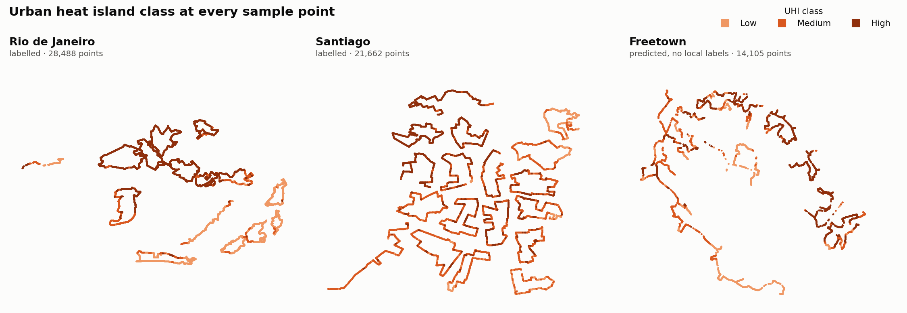
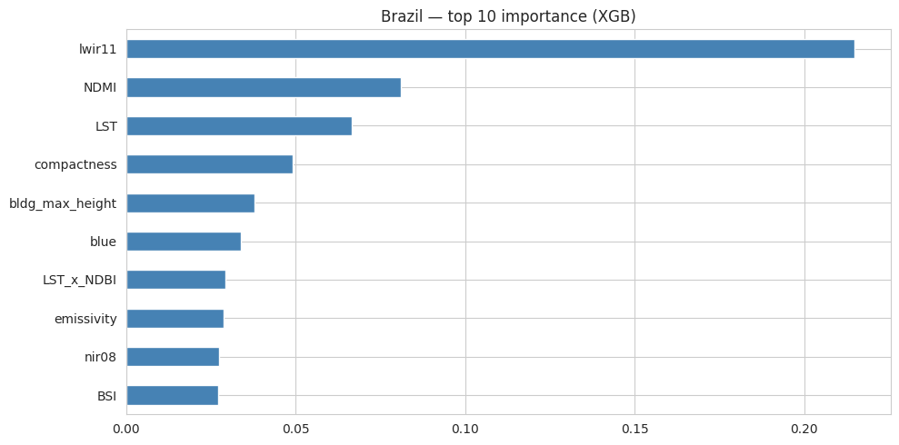
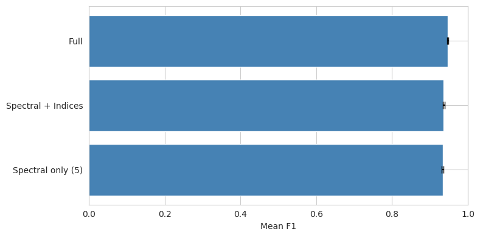
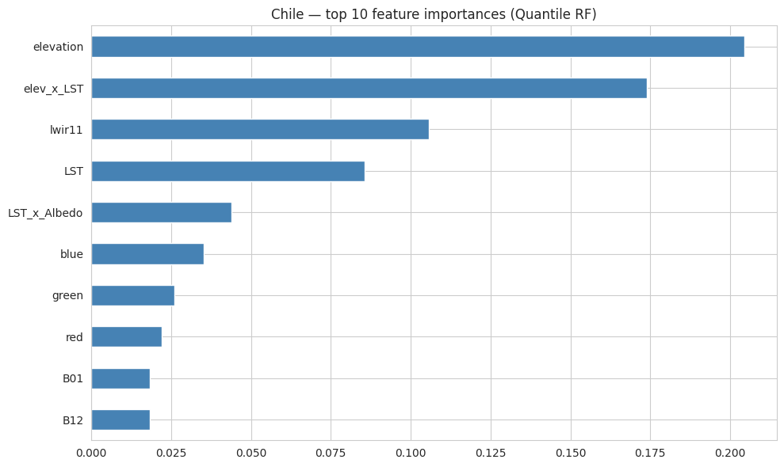
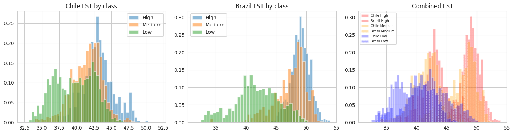

# Predicting Urban Heat Islands from Satellite Data: Rio, Santiago, Freetown

Classifying urban heat island (UHI) intensity (Low / Medium / High) at 100 m
from Sentinel-2, Landsat-8 and elevation data. The models are trained on Rio de
Janeiro and Santiago, then transferred to Freetown, Sierra Leone, a city with
**no labels of its own**.



| City | Task | Model | Weighted F1 | How it was measured |
|---|---|---|---:|---|
| Rio de Janeiro | within-city | XGBoost (class-balanced) | **0.959** | 5-fold stratified CV |
| Santiago | within-city | Quantile-transformed Random Forest | **0.690** | 20% stratified hold-out |
| Freetown | cross-city transfer | Per-class RF + XGBoost specialists | **0.58** | challenge leaderboard (hidden labels) |

Every Rio and Santiago figure above reproduces from this repo in about 4 minutes
(see [How to run](#how-to-run)).

---

## My role

Team project for Hult International Business School, Business Challenge II (Team 4).

- **Me (Youness Yachruti): the machine-learning modelling.** I ran the model search
  and selection for Rio and Santiago (testing model families, resolutions and
  tuning, and picking the best fit for each city from the results) and built
  the transfer model that predicts Freetown.
- **Mickias Ambaye: satellite extraction.** His [`uhi_pipe`](https://github.com/Mickias-Ambaye/uhi-pipe)
  package is vendored in [`uhi_pipe/`](uhi_pipe/CREDITS.md) with his permission,
  and his commits are preserved in this history. He also wrote
  `notebooks/01_data_extraction.ipynb`.
- **Team:** Carolina Trovisco, Filippo Beni, João Ponte, Mickias Ambaye,
  Youness Yachruti, Yousra Sajjad. The written report is in
  [`reports/`](reports/Urban%20Heat%20Indicator%20-%20Team%204%20-%20BC2.pdf).

## Architecture

```
 Microsoft Planetary Computer            Microsoft Fabric (Python notebooks)
 Sentinel-2 · Landsat-8 · DEM ──► uhi_pipe ──► Lakehouse Files ──► models ──► predictions
 3D-GloBFP building footprints    (extract)    dataset_100m_*.csv   02_uhi_    freetown_
                                               buildings_*.csv      classif.   predictions.csv
                                                     │
                                         mirrored in data/raw/ so the same
                                         notebooks also run on any laptop
```

- **Cloud:** the project ran in Microsoft Fabric notebooks, reading from and
  writing to the Lakehouse Files area. [`uhi_models/config.py`](uhi_models/config.py)
  detects the Lakehouse and uses its paths. Anywhere else it uses `data/`, so
  nothing is hard-coded.
- **Memory and storage:** scenes load lazily in 2048 × 2048-pixel chunks as
  `uint16`, and each raster is released once it has been sampled at the points.
  No images are written to disk, and intermediate results are cached as Parquet
  so re-runs skip completed downloads. Details are in [`data/README.md`](data/README.md).

## Approach

**1. Rio: the heat signal is strong, so tune for it.** A class-balanced
XGBoost beat Random Forest in 5-fold CV (0.959 vs 0.947). Thermal bands
dominate (`lwir11`, then moisture `NDMI` and `LST`), followed by building
compactness. The ablation shows how far thermal data alone gets you: 5
spectral bands already score 0.934, and indices plus building morphology add
the last 1.3 points.

<p float="left">
  
  
</p>

**2. Santiago: terrain, not materials.** Half of Santiago's labels are
"Medium", and they overlap both extremes, which makes this city far harder than
Rio. Elevation and the elevation × LST interaction are the top two features,
because the Andean basin creates thermal gradients that surface materials don't
explain. A depth-constrained Random Forest on quantile-transformed features
handled the ambiguous Medium class better than boosting did.



**3. Freetown: the transfer problem.** Raw temperatures don't carry across
cities. Santiago's "High" sits at about the same land-surface temperature as
Rio's "Low".



Leave-one-city-out tests confirmed it: a model trained on Rio scores F1 0.36 on
Santiago, and Santiago → Rio scores 0.47. So the transfer model:

1. Uses five thermal and spectral features (`lwir11`, `LST`, `SWIR2_NIR`,
   `blue`, `nir08`) and **quantile-transforms** them separately for the
   training city and for Freetown. Each side is ranked against itself, so
   "hot for Freetown" lines up with "hot for Rio" even though the absolute
   temperatures differ.
2. Compresses them to **3 principal components** fitted on the training
   city. On Rio and Santiago combined, 3 components keep 96% of the variance.
3. Trains a **one-vs-rest specialist per class** on the source that matches
   Freetown best for that class: *High* from Rio's dense tropical core,
   *Medium* from Santiago's mixed fringe, *Low* from both cities.
4. Averages the Random Forest and XGBoost specialist scores.

This scored **0.58** on the challenge leaderboard. With no local labels, the
notebook can only check its predictions against KMeans pseudo-labels (0.518),
and that number measures agreement with spectral clusters, not accuracy.

## Repository layout

```
├── data/
│   ├── raw/            model inputs: 5 tables, 3 cities (data card: data/README.md)
│   └── processed/      predictions for Rio, Santiago, Freetown
├── notebooks/
│   ├── 01_data_extraction.ipynb      satellite → data/raw (needs network)
│   ├── 02_uhi_classification.ipynb   the full modelling pipeline ✅ reproducible
│   └── research/                     Fabric model-search log (see notebooks/README.md)
├── uhi_models/         data access and Fabric/local path detection
├── uhi_pipe/           satellite extraction package (Mickias Ambaye)
└── reports/            figures, make_figures.py, team report (PDF)
```

## How to run

```bash
git clone https://github.com/youness-yach/uhi-business-challenge.git
cd uhi-business-challenge
pip install -e .                         # add ".[extract]" to re-pull satellite data
jupyter nbconvert --to notebook --execute --inplace notebooks/02_uhi_classification.ipynb
python reports/make_figures.py           # rebuilds reports/figures/
```

On Microsoft Fabric, upload `data/raw/*.csv` to the Lakehouse Files area,
`%pip install` this repo in the notebook session, and run the same notebook.

## Limitations

- Freetown has no ground truth. Its 0.58 comes from the leaderboard's hidden
  labels, so the error can't be broken down by class.
- Each city is a single satellite composite, one date window. Seasonal and
  hourly data would be the natural next step, along with higher-resolution
  building morphology (see the team report).
- Heat drivers turned out to be city-specific: materials and sun in Rio,
  terrain in Santiago. One universal model would lose to per-city models,
  which is why the transfer relies on class specialists.

---
Youness Yachruti · [LinkedIn](https://www.linkedin.com/in/youness-yachruti/)
